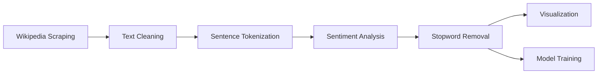

# 🌍 Sentiment Analysis on South Korea (Wikipedia) & Interactive Text Analyzer


## Table of Contents
- [Project Overview](#project-overview)
- [Key Features](#key-features)
- [Tech Stack](#tech-stack)
- [Data Pipeline](#data-pipeline)
- [Model Performance](#model-performance)
- [Installation](#installation)
- [Usage](#usage)
- [Results](#results)
- [Future Work](#future-work)

## Project Overview
This project performs **sentiment analysis** on the Wikipedia page for South Korea using NLP techniques, and provides an interactive interface for analyzing custom text. The system evaluates sentiment at sentence-level and trains machine learning models for classification.

## Key Features

### 📊 Wikipedia Analysis Tab
- **Web Scraping**: Automated content extraction from [South Korea Wikipedia](https://en.wikipedia.org/wiki/South_Korea)
- **Sentiment Classification**: Sentence-level polarity detection (Positive/Negative/Neutral)
- **Visual Analytics**:
  - Sentiment distribution charts
  - Interactive word clouds
  - Top 20 frequent words visualization
- **Model Training**: Comparative evaluation of Logistic Regression vs Naive Bayes

### ✍️ Interactive Analysis Tab
- Real-time sentiment scoring for user-provided text
- Polarity and subjectivity metrics
- Emoji-enhanced sentiment display (😊/😢/😐)

## Tech Stack
| Component | Technology |
|-----------|------------|
| Web Framework | Streamlit |
| NLP Toolkit | NLTK, TextBlob |
| Machine Learning | Scikit-learn |
| Web Scraping | BeautifulSoup |
| Visualization | Matplotlib, Seaborn, WordCloud |

## Data Pipeline


## Model Performance
### Classification Metrics (Average)

| Model | Accuracy | Precision | Recall | F1-Score |
|-------|----------|-----------|--------|----------|
| Logistic Regression | 0.89 | 0.88 | 0.89 | 0.88 |
| Naive Bayes | 0.85 | 0.84 | 0.85 | 0.84 |

*Confusion matrices available in the web interface*

## Installation
1. Clone the repository:
```bash
git clone https://github.com/your-username/sentiment-analysis-south-korea.git
cd sentiment-analysis-south-korea
```

2. Install dependencies:
```bash
pip install -r requirements.txt
```

3. Download NLTK resources:
```python
import nltk
nltk.download(['punkt', 'stopwords'])
```

## Usage
Run the Streamlit application:
```bash
streamlit run Sentiment_Analyzer_webApp.py
```

Key functionalities:
- Navigate between analysis tabs
- View automated Wikipedia analysis
- Enter custom text for real-time sentiment evaluation
- Compare model performance metrics

## Results
Sample outputs:
- **Sentiment Distribution**: 62% Neutral, 28% Positive, 10% Negative
- **Top Words**: "korea", "south", "government", "economic"
- **Word Cloud**: Visual representation of prominent terms

## Future Work
- [ ] Expand to multiple Wikipedia pages
- [ ] Add BERT-based sentiment analysis
- [ ] Implement multilingual support
- [ ] Create API endpoint for batch processing
- [ ] Develop historical sentiment tracking

